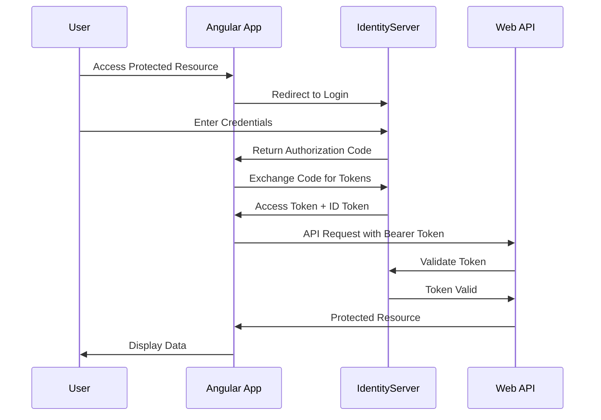

# Talent Management Client - Angular

A modern, feature-rich Single Page Application (SPA) for talent management built with Angular 20, Bootstrap 5, and TypeScript. This application provides comprehensive employee, position, department, and salary range management with advanced data visualization and export capabilities.

## 🌟 Features

### Core Functionality

- **Employee Management**: Full CRUD operations for employee records with detailed forms and validation
- **Position Management**: Create and manage organizational positions with department and salary range associations
- **Department Management**: Organize your company structure with department hierarchies and position tracking
- **Salary Range Management**: Define and manage salary ranges for different positions

### Modern UI/UX

- **Dual View Modes**: Switch between modern grid cards and traditional table views
- **Responsive Design**: Fully responsive layout that works on desktop, tablet, and mobile devices
- **Dark/Light Theme Support**: Integrated theme switching with user preference persistence
- **Interactive Data Tables**: Server-side processing with search, sort, and pagination using DataTables
- **Modal Dialogs**: Rich modal interfaces for detailed record viewing and editing

### Advanced Features

- **Excel Export**: Export employee, position, department, and salary data to Excel format with proper formatting
- **Real-time Validation**: Form validation with instant feedback using Angular Reactive Forms
- **Internationalization (i18n)**: Multi-language support with ngx-translate
- **Progressive Web App (PWA)**: Offline capability and mobile app-like experience
- **Authentication**: OAuth2/OIDC integration with IdentityServer 7 for secure user authentication
- **State Management**: Signal-based reactive state management for optimal performance

## 🚀 Getting Started for New Developers

### Prerequisites

- **Node.js** (v18 or higher) - [Download](https://nodejs.org/)
- **npm** (comes with Node.js)
- **Git** - [Download](https://git-scm.com/)
- **Angular CLI** (optional but recommended): `npm install -g @angular/cli`

### Installation

1. **Clone the repository**:

```bash
git clone [repository-url]
cd TalentManagement-Client-Angular
```

2. **Install dependencies**:

```bash
npm install
```

3. **Start the development server**:

```bash
npm start
```

4. **Open your browser** and navigate to `http://localhost:4200`

### Development Workflow

#### Running the Application

```bash
# Development server with hot reload
npm start

# Production build
npm run build

# Run with service worker (PWA testing)
npm run serve:sw
```

#### Testing

```bash
# Run unit tests
npm test

# Run unit tests once (CI)
npm run test:ci

# Run end-to-end tests
npm run e2e

# Open Cypress test runner
npm run cypress:open
```

#### Code Quality

```bash
# Lint TypeScript and SCSS files
npm run lint

# Format code with Prettier
npm run prettier

# Check code formatting
npm run prettier:check
```

#### Internationalization

```bash
# Extract translation strings
npm run translations:extract
```

## 🏗️ Architecture Overview

### Project Structure

```
src/
├── app/
│   ├── @shared/           # Shared components, services, and utilities
│   ├── core/              # Singleton services and app-wide providers
│   ├── features/          # Feature modules (employees, positions, etc.)
│   │   ├── employee/      # Employee management
│   │   ├── position/      # Position management
│   │   ├── department/    # Department management
│   │   └── salaryrange/   # Salary range management
│   ├── services/          # Application services
│   │   ├── api/           # API communication services
│   │   ├── export/        # Excel export service
│   │   ├── modal/         # Modal dialog service
│   │   └── toast/         # Notification service
│   ├── shell/             # Application shell (header, navigation)
│   └── i18n/              # Internationalization services
├── assets/                # Static assets (images, fonts, etc.)
├── environments/          # Environment configurations
└── translations/          # Translation files
```

### Key Technologies

- **Angular 20**: Latest Angular framework with standalone components
- **TypeScript 5.8**: Modern JavaScript with static typing
- **Bootstrap 5**: CSS framework for responsive design
- **Angular DataTables**: Advanced data table functionality
- **ng-bootstrap**: Angular-specific Bootstrap components
- **RxJS**: Reactive programming with observables
- **Signal-based State Management**: Modern Angular state management

## 🔐 Authentication & Authorization

This application implements a comprehensive authentication system using **OpenID Connect (OIDC)** and **OAuth2** protocols with **IdentityServer 7**.

### Authentication Architecture

The system consists of three main components:

1. **Angular Client** (this repository) - The frontend SPA
2. **Web API** - [TalentManagement .NET 9 API](https://github.com/workcontrolgit/TalentManagementNet9.git)
3. **Identity Server** - [Duende IdentityServer v7 AdminUI](https://github.com/workcontrolgit/Duende-IdentityServer-v7-AdminUI.git)

### OIDC Flow



### Identity Server Configuration

The **Duende IdentityServer v7** provides:

- **User Authentication**: Secure login/logout functionality
- **Token Management**: Access tokens, refresh tokens, and ID tokens
- **Client Authorization**: SPA client configuration for implicit flow
- **Admin UI**: Management interface for users, clients, and resources
- **Multi-tenant Support**: Organization-based user isolation

### Angular OIDC Integration

The Angular application uses `angular-oauth2-oidc` library for seamless integration:

```typescript
// OIDC Configuration
const authConfig: AuthConfig = {
  issuer: 'https://your-identity-server-url',
  clientId: 'talent-management-spa',
  responseType: 'code',
  redirectUri: window.location.origin,
  scope: 'openid profile talent-management-api',
  showDebugInformation: true,
};
```

### API Security

The **.NET 9 Web API** is secured with:

- **JWT Bearer Authentication**: Validates access tokens from IdentityServer
- **Role-based Authorization**: Different access levels for different user roles
- **CORS Configuration**: Allows requests from the Angular SPA
- **API Scopes**: Fine-grained access control for different resources

### Getting Started with Authentication

1. **Set up Identity Server**:

```bash
git clone https://github.com/workcontrolgit/Duende-IdentityServer-v7-AdminUI.git
cd Duende-IdentityServer-v7-AdminUI
# Follow setup instructions in that repository
```

2. **Set up Web API**:

```bash
git clone https://github.com/workcontrolgit/TalentManagementNet9.git
cd TalentManagementNet9
# Configure connection strings and IdentityServer settings
dotnet run
```

3. **Configure Angular Client**:

```bash
# Update environment files with your IdentityServer URL
# src/environments/environment.ts
export const environment = {
  identityServerUrl: 'https://localhost:5001',
  apiUrl: 'https://localhost:7001/api',
  // ... other settings
};
```

### Security Features

- **Automatic Token Renewal**: Refresh tokens handle token expiration
- **Route Guards**: Protect routes that require authentication
- **HTTP Interceptors**: Automatically attach bearer tokens to API requests
- **Logout Handling**: Proper cleanup of tokens and session state
- **PKCE Support**: Enhanced security for public clients

## 🌐 Web API Integration

### API Architecture

The application integrates with a **.NET 9 Web API** following clean API patterns with centralized services:

#### API Services Structure

```typescript
// Core API Services
├── ApiHttpService          # HTTP client wrapper with interceptors
├── ApiEndpointsService     # Centralized endpoint management
└── Interceptors/
    ├── ApiPrefixInterceptor    # Adds API base URL
    └── ErrorHandlerInterceptor # Global error handling
```

#### API Endpoints

**Employee Management**

```typescript
// GET /api/employees/paged - Server-side paginated employee list
// GET /api/employees/{id} - Get employee by ID
// POST /api/employees - Create new employee
// PUT /api/employees/{id} - Update employee
// DELETE /api/employees/{id} - Delete employee
```

**Position Management**

```typescript
// POST /api/positions/paged - Server-side paginated position list
// GET /api/positions/{id} - Get position by ID
// POST /api/positions - Create new position
// PUT /api/positions/{id} - Update position
// DELETE /api/positions/{id} - Delete position
```

**Department Management**

```typescript
// GET /api/departments - Get all departments
// GET /api/departments/{id} - Get department by ID
// POST /api/departments - Create new department
// PUT /api/departments/{id} - Update department
// DELETE /api/departments/{id} - Delete department
```

**Salary Range Management**

```typescript
// GET /api/salaryranges - Get all salary ranges
// GET /api/salaryranges/{id} - Get salary range by ID
// POST /api/salaryranges - Create new salary range
// PUT /api/salaryranges/{id} - Update salary range
// DELETE /api/salaryranges/{id} - Delete salary range
```

### API Integration Patterns

#### Service Layer Pattern

```typescript
@Injectable()
export class EmployeeService {
  constructor(
    private apiHttp: ApiHttpService,
    private endpoints: ApiEndpointsService,
  ) {}

  getEmployees(params: DataTablesParameters): Observable<DataTablesResponse> {
    return this.apiHttp.post(this.endpoints.postEmployeesPagedEndpoint(), params);
  }
}
```

#### Data Transfer Objects (DTOs)

All API communication uses strongly-typed interfaces:

```typescript
export interface Employee {
  id: string;
  employeeNumber: string;
  firstName: string;
  lastName: string;
  email: string;
  positionId: string;
  position?: Position;
  salary: number;
  // ... other properties
}

export interface DataTablesResponse {
  data: any[];
  recordsTotal: number;
  recordsFiltered: number;
  draw: number;
}
```

#### Error Handling

Global error handling with user-friendly messages:

```typescript
// Automatic retry logic for failed requests
// Toast notifications for errors
// Loading states during API calls
// Validation error display in forms
```

### Server-Side Processing

The application implements server-side processing for large datasets:

- **Pagination**: Server handles page size and offset
- **Searching**: Real-time search with debouncing
- **Sorting**: Multi-column sorting support
- **Filtering**: Advanced filtering capabilities

## 🔧 Development Guidelines

### Component Architecture

- **Standalone Components**: Using Angular's new standalone component architecture
- **Signal-Based State**: Reactive state management with Angular signals
- **Reactive Forms**: Form handling with validation and type safety
- **Lazy Loading**: Feature modules are lazy-loaded for optimal performance

### Code Standards

- **TypeScript Strict Mode**: Enabled for better type safety
- **ESLint**: Code quality and consistency
- **Prettier**: Automatic code formatting
- **Husky**: Pre-commit hooks for quality assurance

### Testing Strategy

- **Unit Tests**: Jasmine and Karma for component testing
- **E2E Tests**: Cypress for integration testing
- **Code Coverage**: Comprehensive test coverage reporting

## 📦 Build and Deployment

### Production Build

```bash
npm run build
```

### GitHub Pages Deployment

```bash
ng deploy --base-href "/TalentManagement-Client-Angular/"
```

### Environment Configuration

Configure different environments in `src/environments/`:

- `environment.ts` - Development
- `environment.prod.ts` - Production

## 🤝 Contributing

1. Fork the repository
2. Create a feature branch: `git checkout -b feature/new-feature`
3. Make your changes
4. Run tests: `npm run test:ci`
5. Commit your changes: `git commit -m 'Add new feature'`
6. Push to the branch: `git push origin feature/new-feature`
7. Submit a pull request

## 📚 Related Repositories

This project is part of a comprehensive talent management system with the following repositories:

### Backend Services

- **[TalentManagement .NET 9 API](https://github.com/workcontrolgit/TalentManagementNet9.git)** - RESTful API built with .NET 9, Entity Framework Core, and comprehensive business logic
- **[Duende IdentityServer v7 AdminUI](https://github.com/workcontrolgit/Duende-IdentityServer-v7-AdminUI.git)** - OAuth2/OIDC authentication server with administrative interface

### Frontend Applications

- **Talent Management Angular Client** (this repository) - Modern SPA built with Angular 20

## 📚 Additional Resources

- [Angular Documentation](https://angular.io/docs)
- [Bootstrap Documentation](https://getbootstrap.com/docs)
- [DataTables Documentation](https://datatables.net/)
- [ng-bootstrap Components](https://ng-bootstrap.github.io/)
- [Duende IdentityServer Documentation](https://docs.duendesoftware.com/identityserver/v7)
- [Angular OAuth2 OIDC Library](https://github.com/manfredsteyer/angular-oauth2-oidc)

## 🐛 Troubleshooting

### Common Issues

**Build Errors**: Clear node_modules and reinstall

```bash
rm -rf node_modules package-lock.json
npm install
```

**Port Already in Use**: Change port in angular.json or use

```bash
ng serve --port 4201
```

**Proxy Issues**: Check proxy.conf.js configuration for API endpoints

## 📄 License

This project is licensed under the MIT License - see the LICENSE file for details.

---

For more detailed information, check out the [tutorial series](https://medium.com/scrum-and-coke/building-a-talent-management-spa-with-angular-17-and-net-core-8-tutorial-series-f28f0edc9069) and visit the [live demo](https://workcontrolgit.github.io/TalentManagement-Client-Angular).
